# Programming Learning Path Website

Website gợi ý lộ trình học lập trình cá nhân hóa với 22 câu hỏi khảo sát và kế hoạch học 30 ngày.

## Demo Screenshots

### Trang chủ và Menu
<div align="center">
  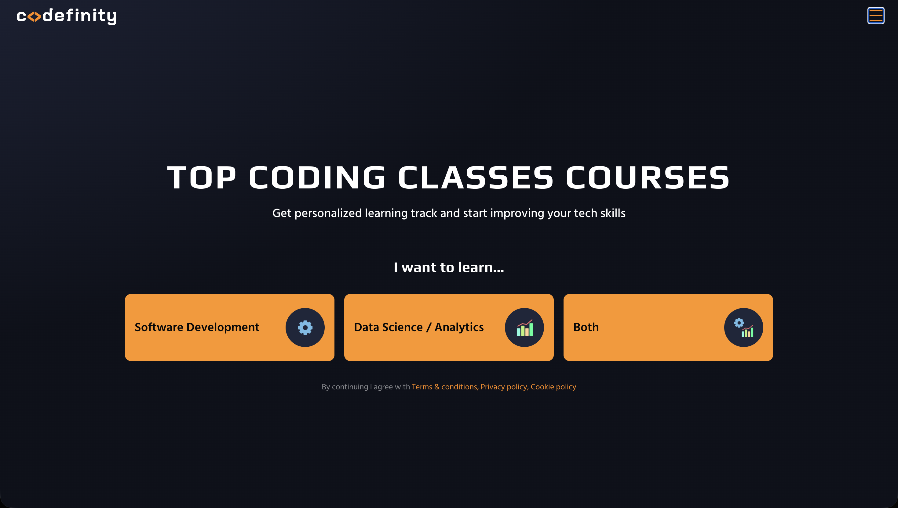
  <p><em>Trang chủ với giao diện thân thiện</em></p>
  
  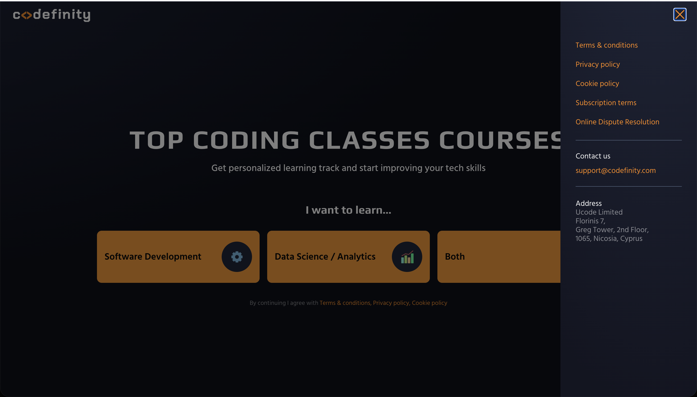
  <p><em>Menu điều hướng chính</em></p>
</div>

### Hệ thống đăng nhập
<div align="center">
  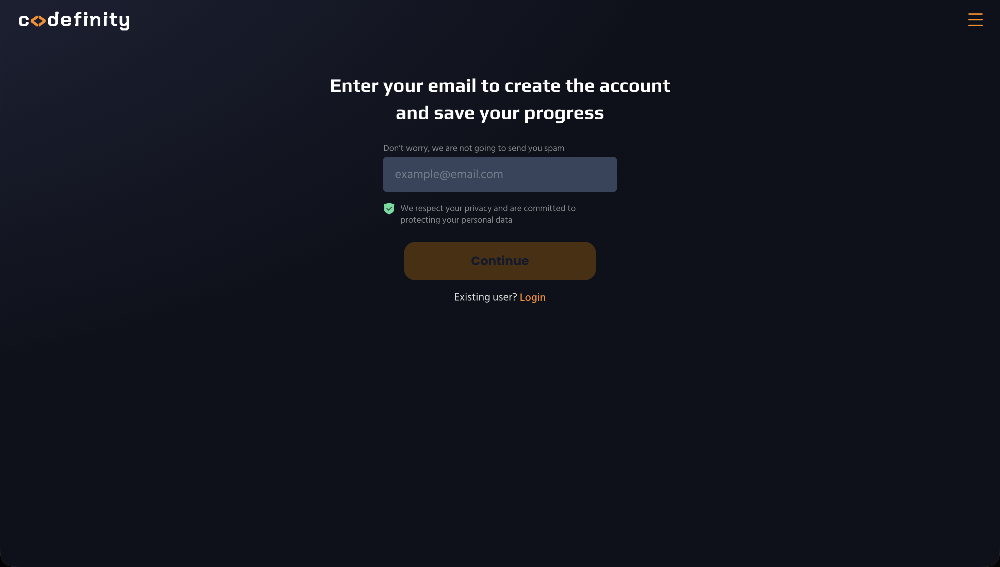
  <p><em>Đăng nhập bằng Google OAuth</em></p>
</div>

### Lựa chọn vai trò
<div align="center">
  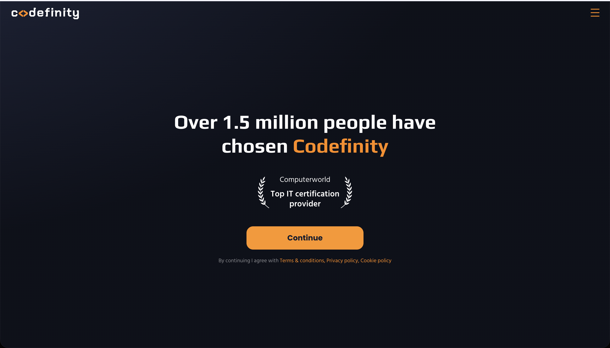
  <p><em>Chọn vai trò phát triển nghề nghiệp</em></p>
</div>

### Hệ thống khảo sát 22 câu hỏi

#### Câu hỏi cơ bản
<div align="center">
  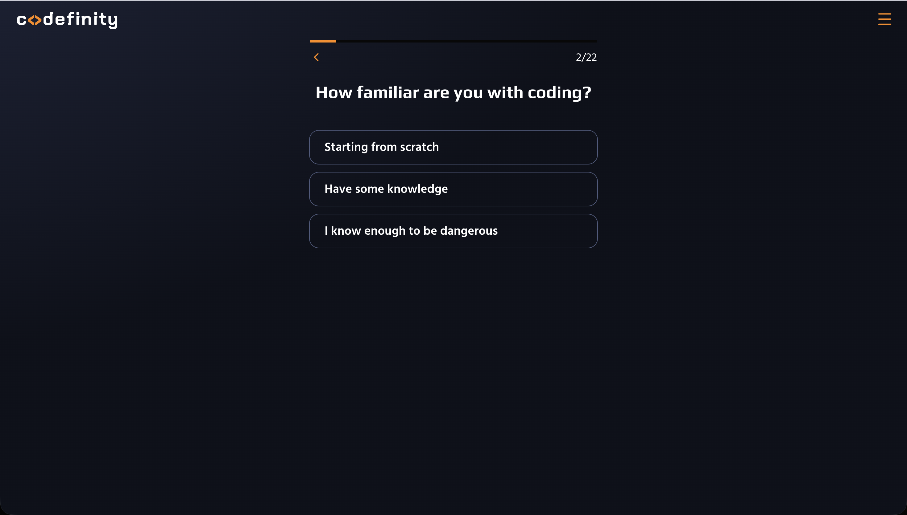
  <p><em>Câu hỏi đầu tiên về kinh nghiệm</em></p>
  
  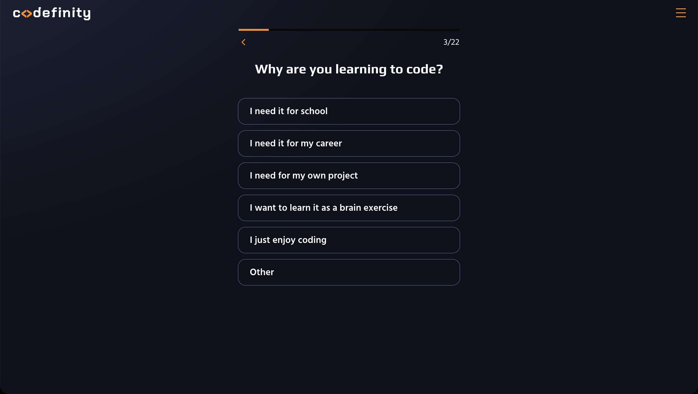
  <p><em>Đánh giá mức độ hiểu biết hiện tại</em></p>
</div>

#### Câu hỏi chuyên biệt theo vai trò
<div align="center">
  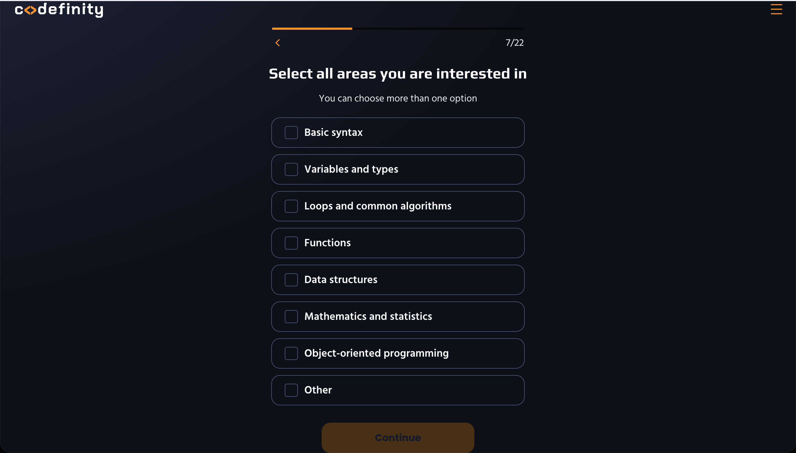
  <p><em>Câu hỏi dành cho Software Engineer</em></p>
  
  
  <p><em>Câu hỏi dành cho Data Scientist</em></p>
</div>

#### Các câu hỏi chuyên sâu
<div align="center">
  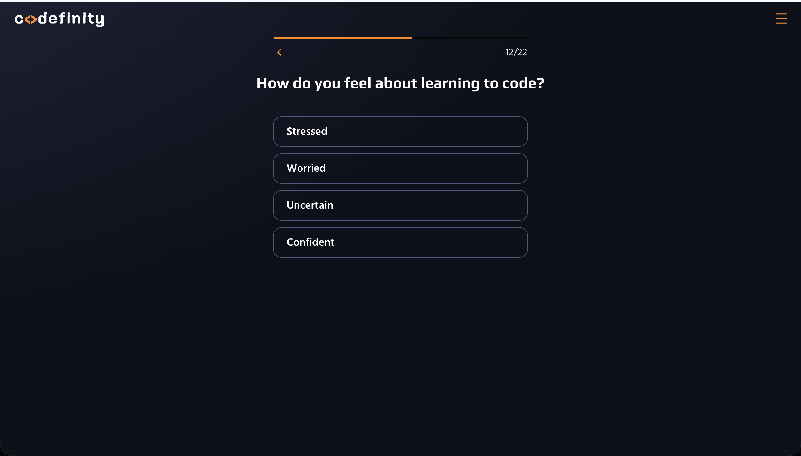
  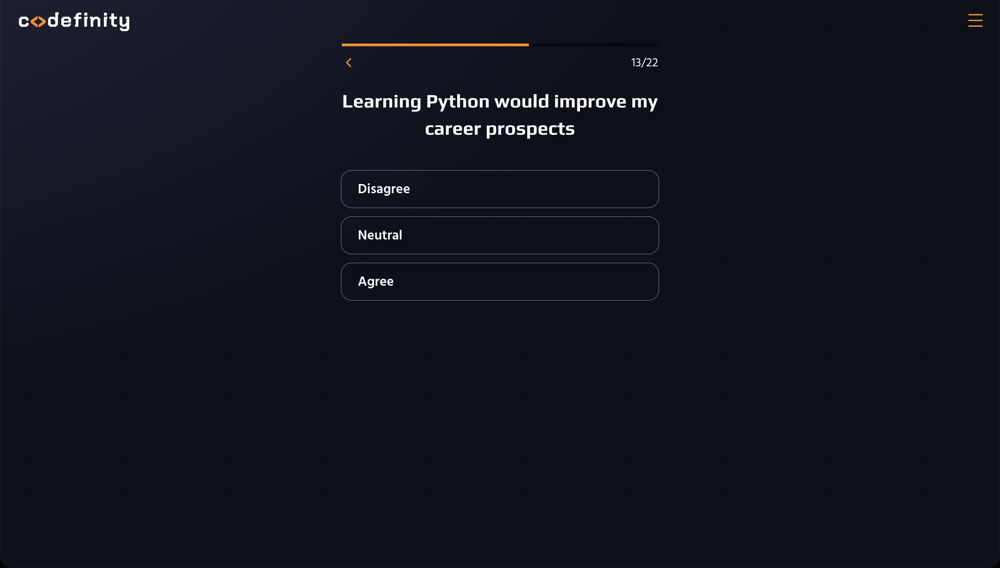
  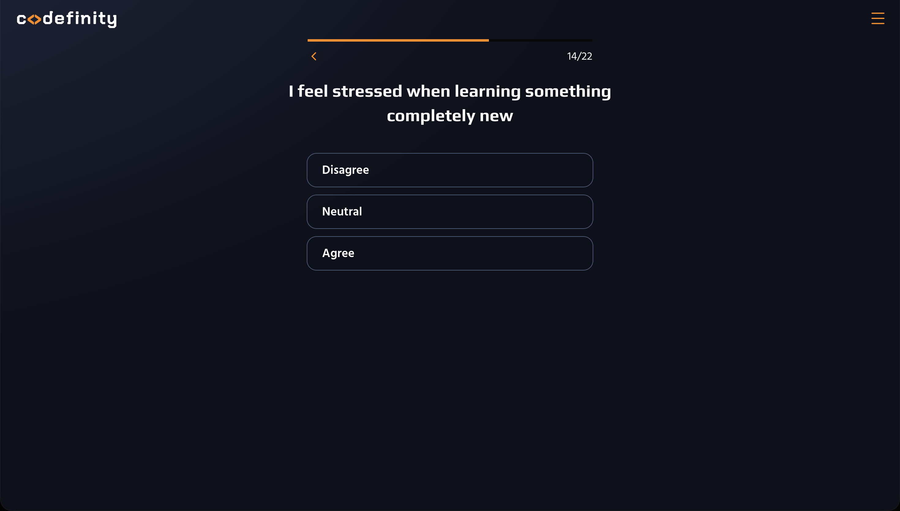
</div>

<div align="center">
  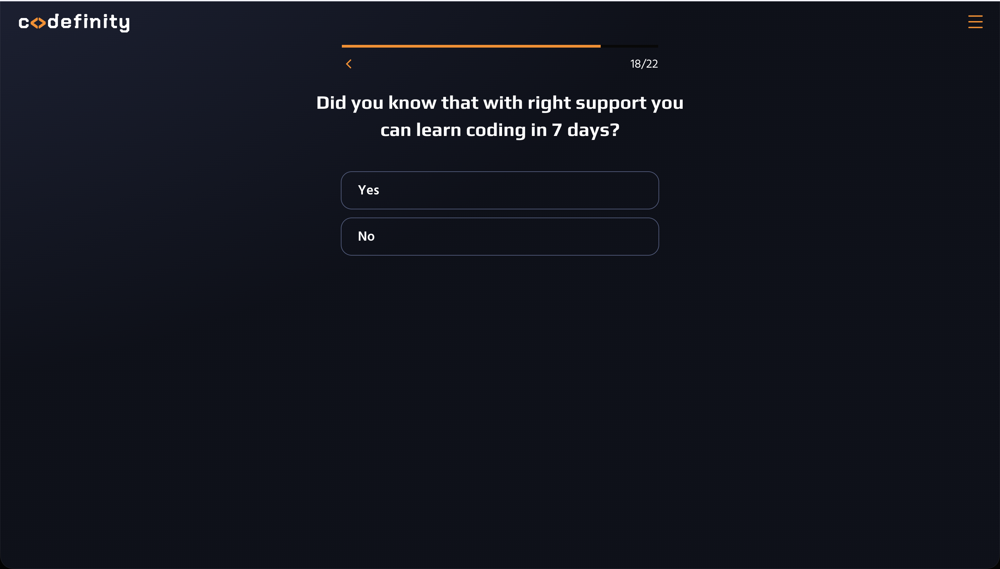
  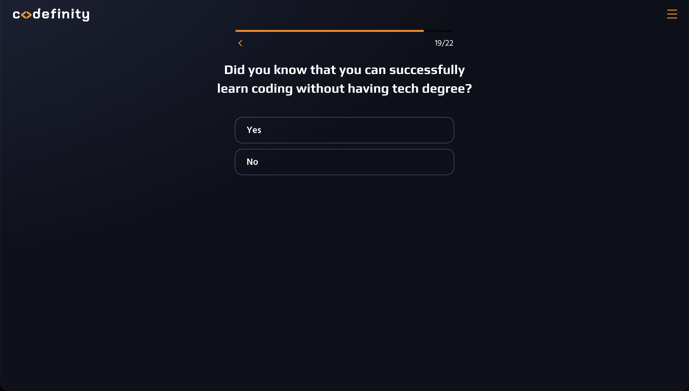
  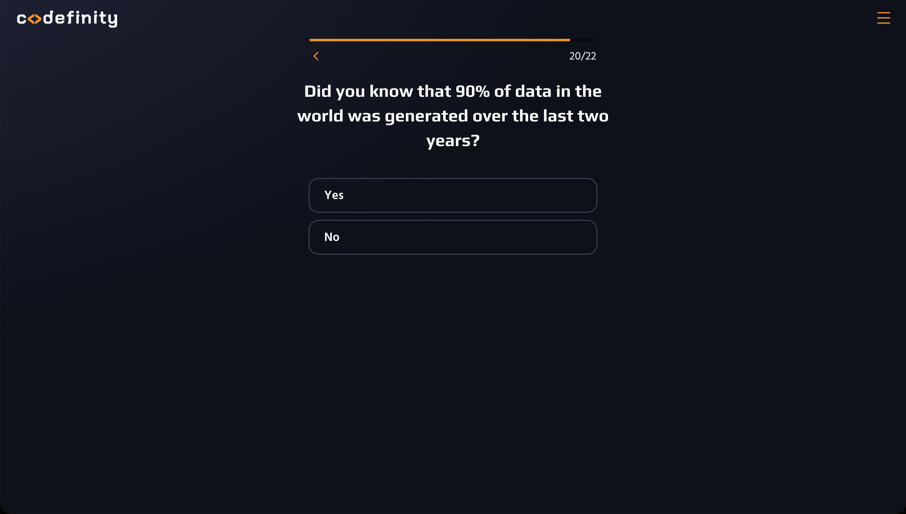
</div>

<div align="center">
  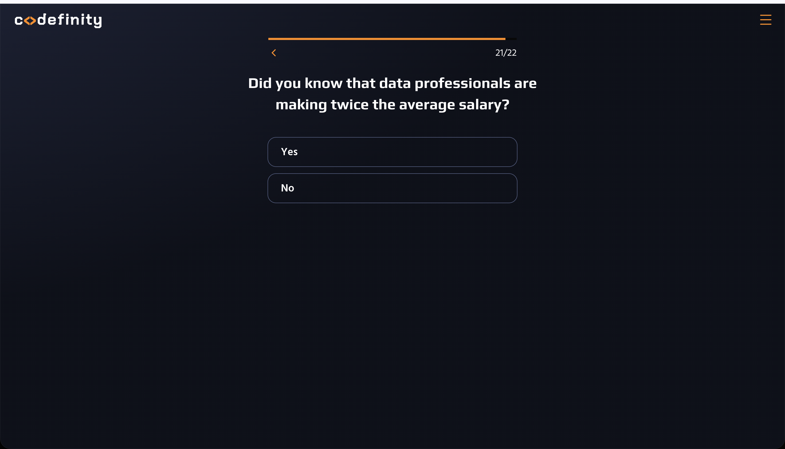
  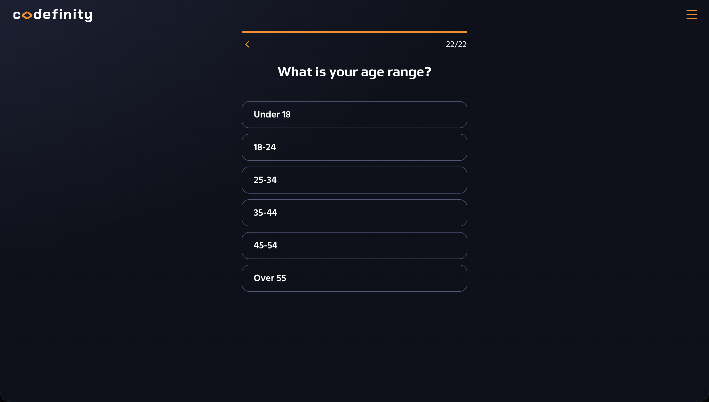
</div>

### Kết quả sau khảo sát
<div align="center">
  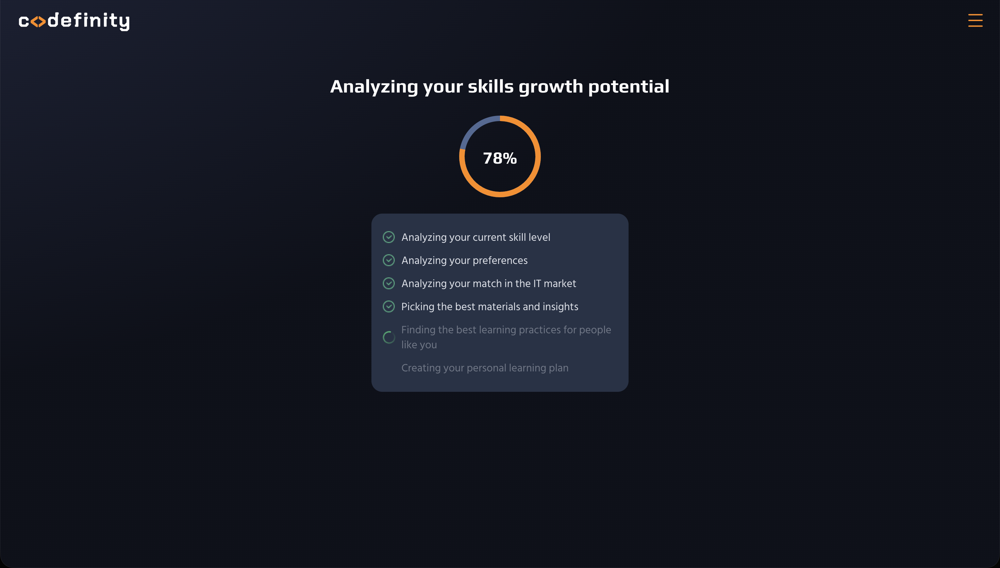
  <p><em>Lộ trình học được tạo dựa trên kết quả khảo sát</em></p>
</div>

## Tính năng

- **Khảo sát thông minh**: 22 câu hỏi được thiết kế để đánh giá chính xác trình độ và mục tiêu
- **Cá nhân hóa**: Lộ trình học được tạo riêng cho từng người dựa trên kết quả khảo sát
- **Nội dung chất lượng**: Video học từ YouTube và tài liệu từ các nguồn uy tín
- **Đăng nhập dễ dàng**: Tích hợp Google OAuth cho trải nghiệm liền mạch
- **Theo dõi tiến độ**: Dashboard trực quan để theo dõi quá trình học tập
- **Đa vai trò**: Hỗ trợ Software Engineering, Data Science, và nhiều lĩnh vực khác

## Công nghệ

**Backend:**
- Python Flask
- SQLite Database
- JWT Authentication
- Google OAuth 2.0

**Frontend:**
- Next.js 14
- TypeScript
- Tailwind CSS
- React Hooks

## Yêu cầu

- Node.js 18+
- Python 3.8+
- Git

## Cài đặt

### 1. Clone repository
```bash
git clone https://github.com/nguyen-phan-duc-minh/Programming-Learning-Path.git
cd Programming-Learning-Path
```

### 2. Setup Backend
```bash
cd programming-path-website/backend

# Cài packages
python3 -m pip install -r requirements.txt

# Setup environment variables
cp .env.example .env
# Điền Google OAuth credentials vào .env
```

### 3. Setup Frontend
```bash
cd ../frontend

# Cài packages
npm install

# Setup environment variables  
cp .env.local.example .env.local
# Điền Google Client ID vào .env.local
```

### 4. Google OAuth Setup
1. Vào [Google Cloud Console](https://console.cloud.google.com/)
2. Tạo project mới hoặc chọn project có sẵn
3. Enable Google+ API
4. Tạo OAuth 2.0 credentials
5. Thêm authorized redirect URIs:
   - `http://localhost:3000/auth/callback`
   - `http://localhost:3000/auth/google/callback`
6. Copy Client ID và Client Secret vào file `.env`

## Chạy ứng dụng

### Khởi tạo database
```bash
cd programming-path-website/backend
python3 init_db.py
```

### Development
```bash
# Terminal 1: Backend
cd programming-path-website/backend
python3 app.py

# Terminal 2: Frontend  
cd programming-path-website/frontend
npm run dev
```

Truy cập: http://localhost:3000

## Cấu trúc dự án

```
programming-path-website/
├── backend/
│   ├── app.py              # Flask application
│   ├── init_db.py          # Database initialization
│   ├── requirements.txt    # Python dependencies
│   └── .env.example       # Environment template
├── frontend/
│   ├── src/
│   │   ├── app/           # Next.js app router
│   │   ├── components/    # React components
│   │   └── lib/          # Utilities & API
│   ├── package.json      # Node dependencies
│   └── .env.local.example # Environment template
└── samples/              # Demo screenshots
```

## Environment Variables

### Backend (.env)
```env
SECRET_KEY=your-flask-secret-key
GOOGLE_CLIENT_ID=your-google-client-id
GOOGLE_CLIENT_SECRET=your-google-client-secret
FLASK_ENV=development
DATABASE_URL=sqlite:///programming_path.db
FRONTEND_URL=http://localhost:3000
```

### Frontend (.env.local)
```env
NEXT_PUBLIC_API_URL=http://localhost:5001
NEXT_PUBLIC_GOOGLE_CLIENT_ID=your-google-client-id
```

## API Endpoints

- `POST /api/survey` - Submit khảo sát
- `POST /api/auth/google` - Google OAuth
- `GET /api/learning-path` - Lấy lộ trình học
- `PUT /api/progress` - Cập nhật tiến độ

## Cách hoạt động

1. **Đăng nhập**: Người dùng đăng nhập bằng Google OAuth
2. **Khảo sát**: Trả lời 22 câu hỏi được thiết kế theo vai trò
3. **Phân tích**: Hệ thống phân tích kết quả và đánh giá trình độ
4. **Tạo lộ trình**: Sinh ra kế hoạch học 30 ngày cá nhân hóa
5. **Học tập**: Truy cập video và tài liệu học theo từng ngày
6. **Theo dõi**: Cập nhật tiến độ và điều chỉnh lộ trình

## Đóng góp

1. Fork repository
2. Tạo feature branch (`git checkout -b feature/AmazingFeature`)
3. Commit changes (`git commit -m 'Add AmazingFeature'`)
4. Push to branch (`git push origin feature/AmazingFeature`)
5. Open Pull Request

## License

MIT License - xem file [LICENSE](LICENSE) để biết thêm chi tiết.

## Tác giả

- Nguyen Phan Duc Minh - [@nguyen-phan-duc-minh](https://github.com/nguyen-phan-duc-minh)

---

Hãy star repository nếu bạn thấy hữu ích!